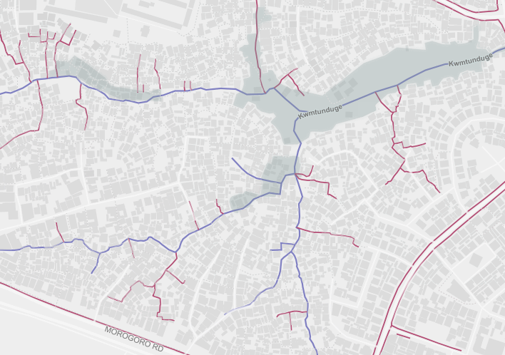

This project contains styles for drainage maps, using data from HOT's mapping project in Dar es Salaam.

In the *mapbox* directory is a MapBox Studio project, which looks like this:

A similar project is in the *qgis* directory, using sample data from Ndugumbi ward.

Feel free to fork and modify.